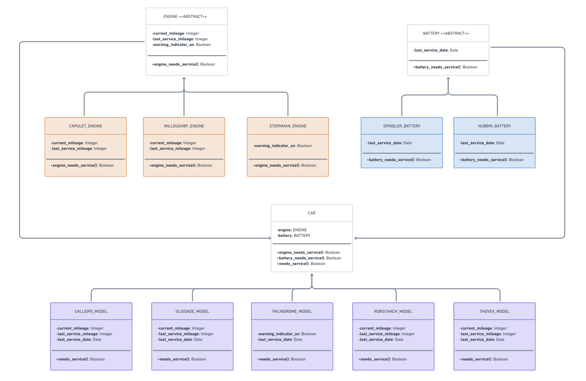

# Lyft Back-End Engineering Virtual Experience Program

This repository contains the code and resources for the Lyft Back-End Engineering Virtual Experience Program. The program covers essential backend engineering concepts and provides hands-on experience through practical exercises.

## Table of Contents
- [Concepts Covered](#concepts-covered)
- [Technologies Used](#technologies-used)
- [Installation](#installation)
- [Usage](#usage)
- [Project Structure](#project-structure)
- [UML Diagram](#uml-diagram)
- [Contributing](#contributing)
- [License](#license)

## Concepts Covered
- UML Diagrams
- Software Design Patterns
- Python Scripting
- Python Modules
- Python OOP (Object-Oriented Programming)
- Unit Testing
- Test-Driven Development (TDD)

## Technologies Used
- **Python**

## Installation
1. Clone the repository:
    ```bash
    git clone https://github.com/dasdebanna/Lyft-Backend-Engineering-Program.git
    ```
2. Navigate to the project directory:
    ```bash
    cd Lyft-Backend-Engineering-Program
    ```
3. (Optional) Create and activate a virtual environment:
    ```bash
    python -m venv venv
    source venv/bin/activate  # On Windows use `venv\Scripts\activate`
    ```
4. Install the dependencies:
    ```bash
    pip install -r requirements.txt
    ```

## Usage
1. Run the Python scripts to explore various backend engineering concepts covered in the program.
2. Execute unit tests to ensure that the code functions as expected:
    ```bash
    python -m unittest discover
    ```

## Project Structure
The project is structured as follows:
- `battery/`: Contains battery-related code and tests.
- `car_factory/`: Contains factory code for car objects.
- `engine/`: Contains engine-related code and tests.
- `test/`: Contains unit tests for various modules.
- `tires/`: Contains tire-related code and tests.
- `car.py`: Main car module.
- `serviceable.py`: Interface for serviceable components.
- `UML.png`: UML diagram of the project.

## UML Diagram


## Contributing
Contributions are welcome! Please follow these steps to contribute:
1. Fork the repository.
2. Create a new branch:
    ```bash
    git checkout -b feature-branch
    ```
3. Make your changes and commit them:
    ```bash
    git commit -m "Add new feature"
    ```
4. Push to the branch:
    ```bash
    git push origin feature-branch
    ```
5. Create a pull request.

## License
This project is licensed under the MIT License. See the [LICENSE](LICENSE) file for details.
